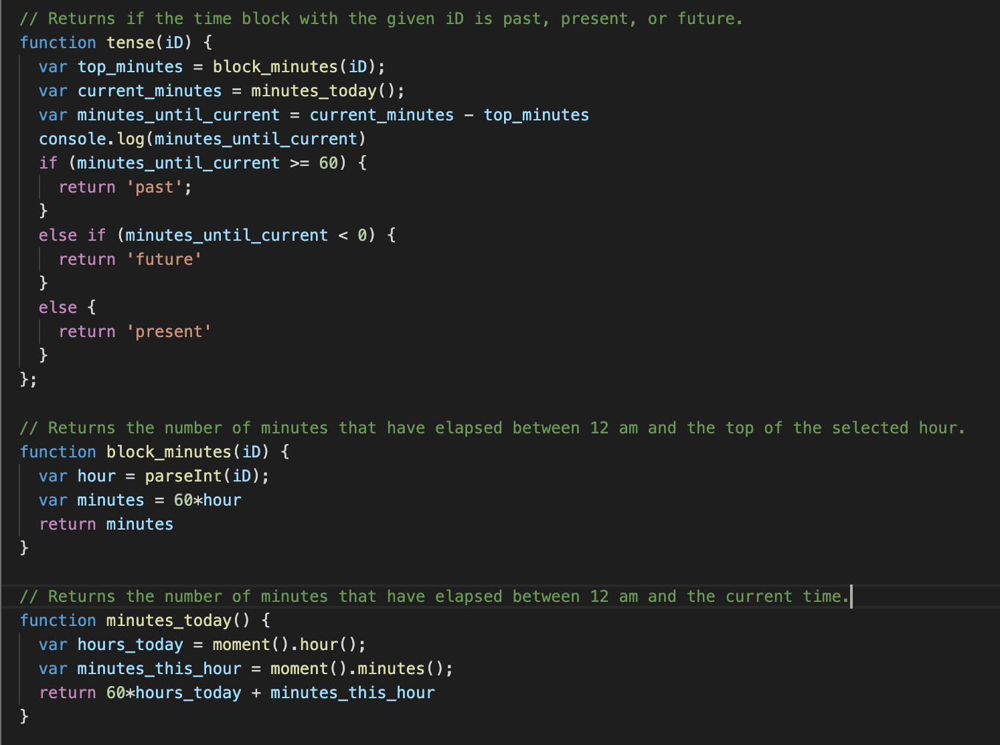
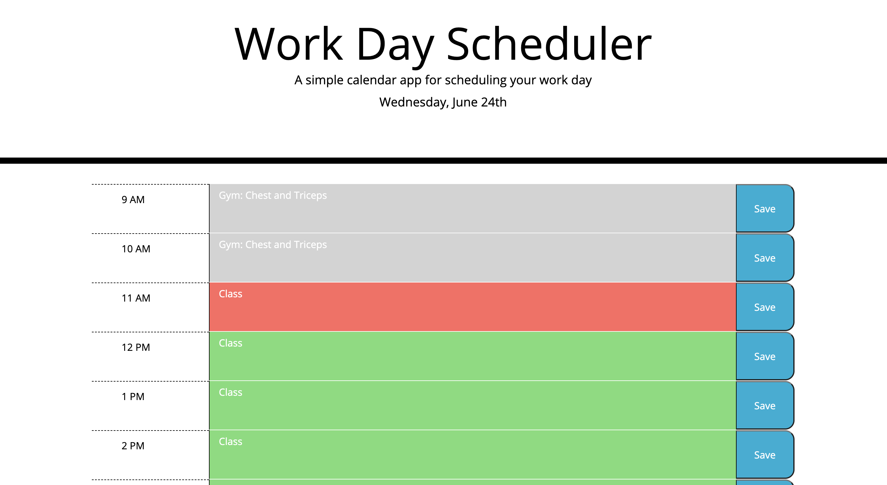

# Hw05_WorkDayScheduler

This ask of this project was to functionalize a simple work day planner. CSS code was provided to style the HTML as seen below, but only the header of the page was provided in the HTML. After producing the structure of the page and applying the given CSS stylings, the task was two fold. Firstly, when the user clicked on a time-block, added an event, and then hit the save button, the page was to save that event so that is persisted upon refresh or closing and re-opening. Secondly, the page was supposed to update dynamically with time. The header was to display the current date, and the time blocks were to appear grey, red, or green depending on if those hours were past, present, or future, respectively.

This project was a synthesis of jQuery DOM manipulation, local storage functionality, Bootstrap CSS formatting, and real-time display updating uses moment.js (see below).

## Getting Started

These instructions will get you a copy of the project up and running on your local machine for development and testing purposes. See deployment for notes on how to deploy the project on a live system.

### Prerequisites

1. Install git by typing `git --version` in your terminal. If you are not sure if you have git or not, typing this will automatically prompt installation if you do not.

### Installing

To get access to this project for development and testing, go through the following steps:

1. Clone the project repository by navigating to a proper directory in terminal and typing `https://github.com/GabeSucich/Hw05_WorkDayScheduler.git`:

2. Edit the javascript file, push to github, and see the live deployed website at the URL below.

## Built With

* [HTML](https://developer.mozilla.org/en-US/docs/Web/HTML)
* [CSS](https://developer.mozilla.org/en-US/docs/Web/CSS)
* [Bootsrap](https://getbootstrap.com/docs/4.5/getting-started/introduction/)
* [Javascript](https://developer.mozilla.org/en-US/docs/Web/JavaScript)
* [jQuery](https://developer.mozilla.org/en-US/docs/Glossary/jQuery)

## Deployed Link

* [See Live Site](https://gabesucich.github.io/Hw05_WorkDayScheduler/)

## Integral Code

The dynamic part of this program is the updating of each time slot as "past", "present", or "future". This was done modularly through the following code, utilizing moment.js as a tool:

## Project Snapshots

### Gabriel Sucich

- [Portfolio coming soon!](#)
- [Link to Github](https://github.com/GabeSucich)
- [Link to LinkedIn](www.linkedin.com/in/gabriel-sucich-6a28a71a8)

See also the list of [contributors](https://github.com/GabeSucich/Hw05_WorkDayScheduler/contributors) who participated in this project.

## Acknowledgments

* Thanks to Trilogy Education Services, a 2U, Inc for providing framework code for this assignments.
* Big shout out to Manuel for the detailed walkthroughs of each task.